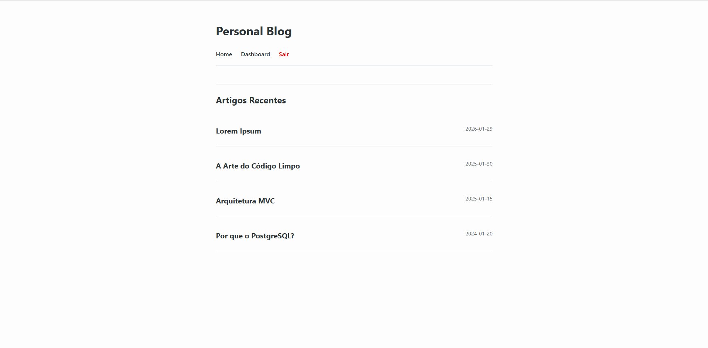
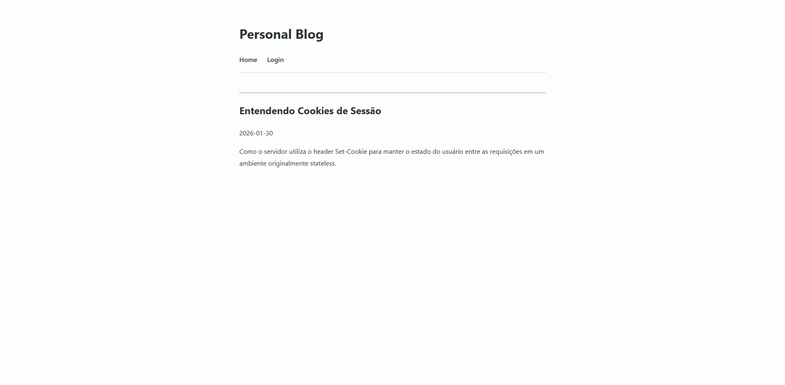
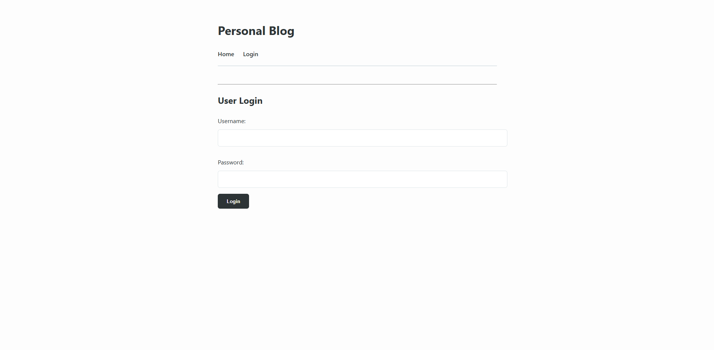
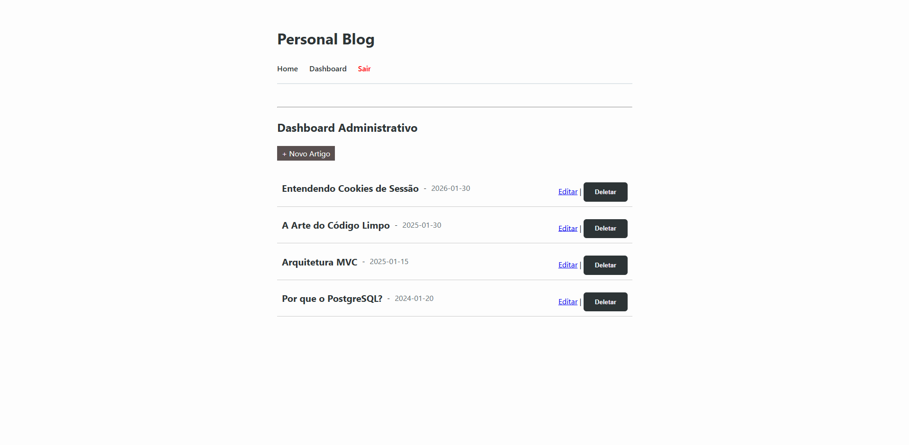
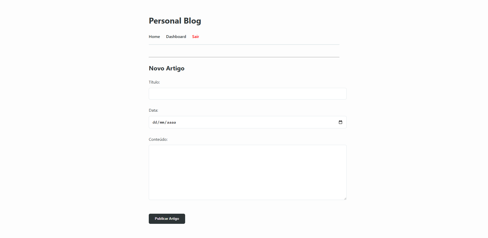
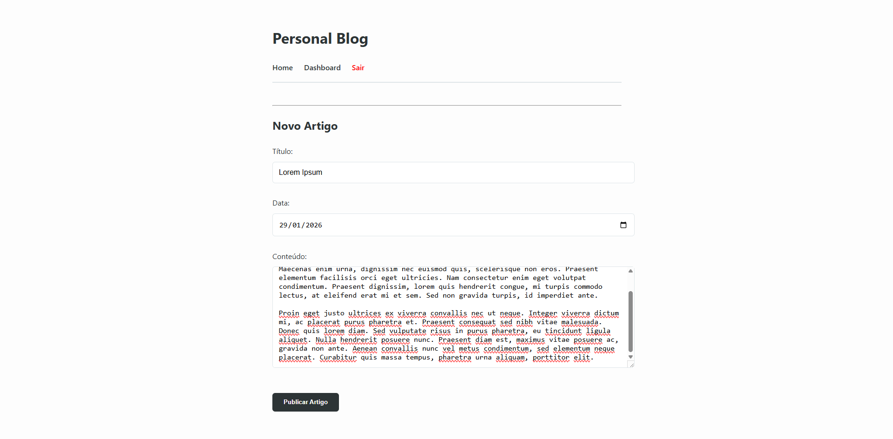
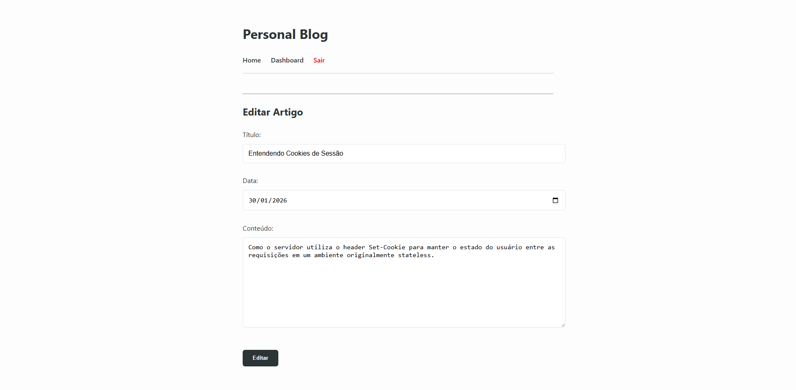
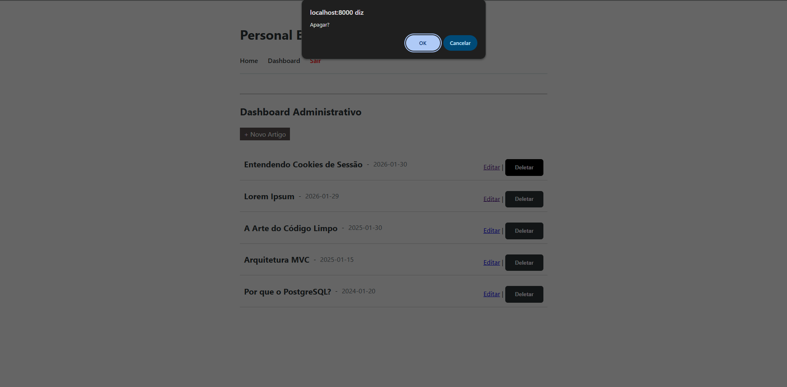
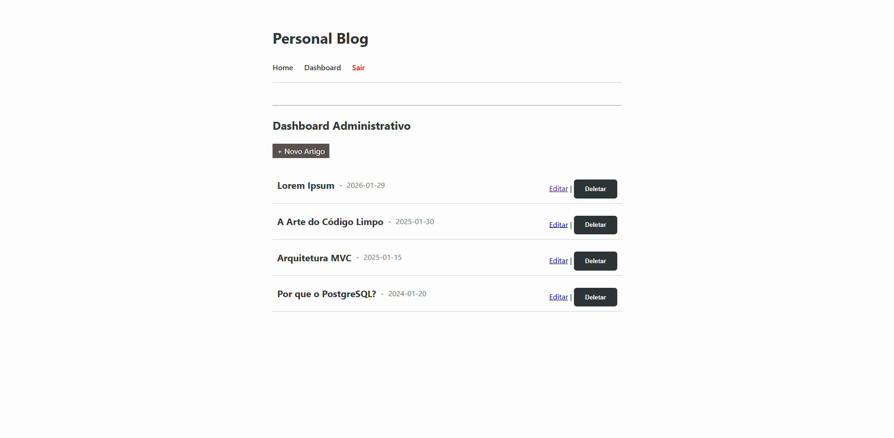

# 📝 Personal Blog - Python + PostgreSQL

Este é um projeto de blog pessoal desenvolvido **sem o uso de frameworks web**. O objetivo principal foi compreender os fundamentos do protocolo HTTP, a implementação manual do padrão de arquitetura **MVC (Model-View-Controller)** e a comunicação direta com um banco de dados relacional.


## Conceitos Utilizados

Para construir este projeto, foram implementados manualmente os seguintes conceitos:

* **Servidor HTTP Nativo:** Utilização do módulo `http.server` do Python para gerenciar conexões via socket e processar requisições brutas.
* **Arquitetura MVC (Model-View-Controller):**
    * **Model:** Gerenciamento de persistência com `psycopg2` e SQL puro, tratando transações (`commit/rollback`) e proteção contra SQL Injection.
    * **View:** Motor de renderização manual utilizando leitura de templates e interpolação de strings.
    * **Controller:** Lógica de roteamento de URLs, processamento de verbos HTTP (GET/POST) e gestão de fluxo da aplicação.
* **Autenticação por Cookies:** Implementação manual de sessões utilizando headers `Set-Cookie` e validação de estado no protocolo HTTP.
* **Serviço de Arquivos Estáticos:** Roteamento manual para entrega de arquivos CSS com definição de `Mime-Type`.

## 🛠️ Tecnologias

* **Linguagem:** Python 3.x
* **Banco de Dados:** PostgreSQL
* **Driver DB:** Psycopg2
* **Frontend:** HTML5 e CSS3

---

## 💻 Como executar o projeto

### 1. Pré-requisitos
* Python 3.x instalado.
* PostgreSQL instalado e em execução.
* Instalação do driver do Postgres:
    ```bash
    pip install psycopg2-binary
    ```
* Instalação do python-dotenv caso deseje utilizar o arquivo `.env`:
    ```bash
    pip install python-dotenv
    ```

### 2. Configuração do Banco de Dados
Crie uma base de dados no seu PostgreSQL e execute o comando abaixo para estruturar a tabela:

```sql
CREATE TABLE articles (
    article_id SERIAL PRIMARY KEY,
    artitle_title VARCHAR(255) NOT NULL,
    article_content TEXT NOT NULL,
    article_date DATE NOT NULL
);

INSERT INTO articles (article_title, article_content, article_date) VALUES 
(
    'Arquitetura MVC', 
    'Neste artigo, exploramos como é construir um sistema web sem o uso de frameworks, lidando manualmente com sockets e protocolos, como HTTP.', 
    '2025-01-15'
),
(
    'Por que o PostgreSQL?', 
    'Uma análise sobre a robustez do PostgreSQL, o uso de SQL puro e a importância de entender transações e integridade de dados.', 
    '2024-01-20'
),
(
    'A Arte do Código Limpo', 
    'Organizar o projeto seguindo o padrão Model-View-Controller ajuda na manutenção e escalabilidade.', 
    '2025-01-30'
),
(
    'Entendendo Cookies de Sessão', 
    'Como o servidor utiliza o header Set-Cookie para manter o estado do usuário entre as requisições em um ambiente originalmente stateless.', 
    '2026-01-30'
);

```

### 3. Configuração do Banco de Dados
No arquivo `models/article.py`, atualize o dicionário `self.conn_params` com suas credenciais locais:

```python
self.conn_params = {
    "dbname": "seu_banco",
    "user": "seu_usuario",
    "password": "sua_senha",
    "host": "localhost",
    "port": "5432"
}
```

### 4. Iniciar o Servidor
Na raiz do diretório do projeto, execute:
```python
python server.py
```
O blog estará disponível em: `http://localhost:8000`

### Acesso ao painel admin
Para acessar o Dashboard e realizar operações de CRUD (Create, Read, Update, Delete):

*   **URL:** /login
*   **Usuário:** admin
*   **Senha:** admin
    

> **Nota:** As credenciais estão codificadas no BlogController.py apenas para fins de demonstração desta arquitetura de estudo.

### Screenshots

| **Home** |
| :-: |
|  |

| **Article** |
| :-: |
|  |

| **Admin Login** |
| :-: |
|  |

| **Admin Dashboard** |
| :-: |
|  |

| **Criando um novo artigo** |
| :-: |
|  |

| **Editando um artigo** |
| :-: |
|  |

| **Excluindo um artigo** |
| :-: |
|  |
|  |
|  |