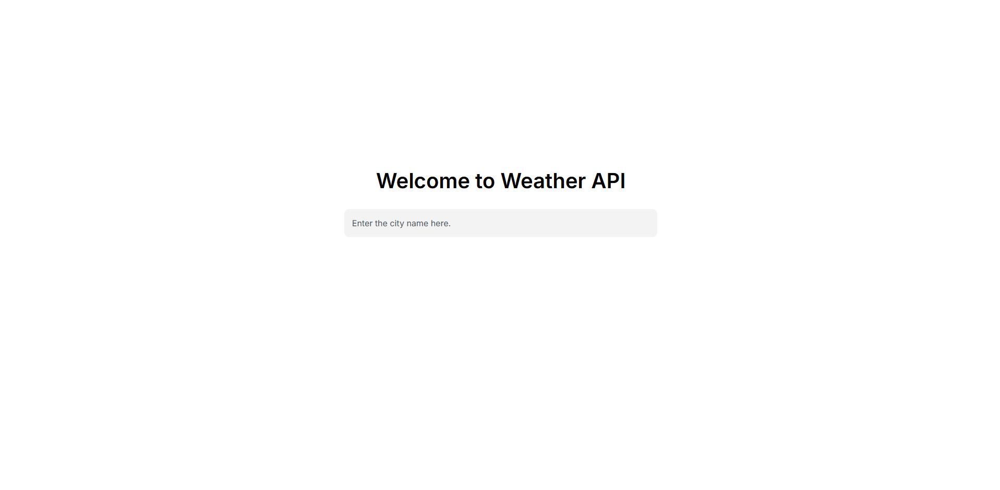
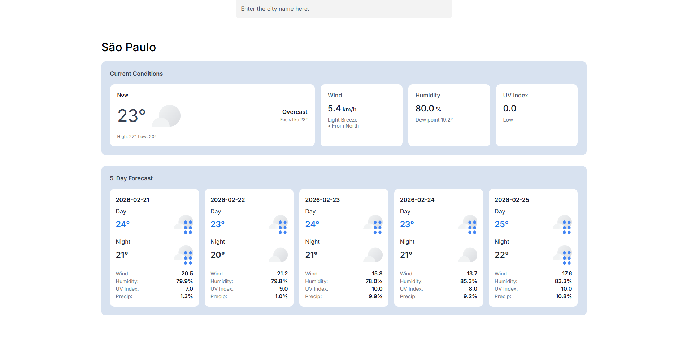

# 🌦️ Weather API Dashboard

Este projeto é uma aplicação web que consome dados da API de meteorologia Visual Crossing e exibe as condições atuais e a previsão para os próximos 5 dias, com uma separação detalhada entre os períodos do dia e da noite. A aplicação foca em boas práticas de backend, como o uso de cache em memória, variáveis de ambiente, containerização e limitação de taxa (rate limiting).

## 🎯 Objetivo

O objetivo principal é demonstrar a construção de um middleware eficiente que:

- Consome e processa dados de APIs externas via requests.
- Otimiza o desempenho e reduz custos de requisições através de cache no Redis.
- Gerencia limites de acesso com flask-limiter para evitar abusos no serviço.
- Separa logicamente dados diurnos e noturnos para uma melhor experiência do usuário.

## 🛠️ Tecnologias Utilizadas

- **Linguagem:** Python 3.x.
- **Framework Web:** Flask.
- **Gerenciador de Pacotes:** Poetry.
- **Cache & Infra:** Redis rodando via Docker.
- **API de Clima:** Visual Crossing.
- **Rate Limiting:** Flask-Limiter.
- **Interface:** Jinja2 templates com ícones dinâmicos do Google Weather.

## 🏗️ Arquitetura do Sistema

A aplicação utiliza o padrão Cache-Aside:

1. O usuário pesquisa uma cidade.
2. O sistema verifica se os dados já existem no container do Redis.
3. Se sim (Cache Hit): Os dados são retornados instantaneamente do cache.
4. Se não (Cache Miss): Uma requisição é feita à API externa, os dados são salvos no cache com expiração de 12 horas e então exibidos.


## 📊 Preview




## 🚀 Como Configurar e Iniciar

### Pré-requisitos

- Python e Poetry instalados.
- Docker instalado em sua máquina.

### 1. Clonar o repositório

```bash
git clone https://github.com/SouzaSantosK/Python_Roadmap.git
cd weather-api-dashboard
```

### 2. Iniciar o Redis via Docker

to rodar o Redis rapidamente com as configurações do projeto:

```bash
docker run -d --name redis-weather -p 6379:6379 redis
```

### 3. Configurar Variáveis de Ambiente

Crie um arquivo `.env` na raiz do projeto:

```plaintext
WEATHER_API_KEY=sua_chave_aqui
host=localhost
db_port=6379
```

### 4. Instalar Dependências e Rodar

1. Instalar dependências com Poetry:

```bash
poetry install
```

2. Ativar o ambiente virutal e iniciar a aplicação:

```bash
# No Windows:
.\.venv\Scripts\activate

# No Linux/Mac:
source .venv/bin/activate

python app.py
```

## 🛠️ Como Usar

A aplicação oferece duas formas principais de interação:

1. **Interface Web (Dashboard)**: Acesse a rota principal no seu navegador para buscar cidades através de uma barra de pesquisa:

```bash
http://127.0.0.1:5000/
```

Digite o nome da cidade no campo de busca. O sistema retornará o clima atual e a previsão para os próximos 5 dias.

2. **Endpoint de API (Dados JSON)**: Para desenvolvedores que desejam apenas os dados puros das condições atuais de uma cidade:

```bash
http://127.0.0.1:5000//weather/<city_name>
```

Exemplo:

```bash
http://localhost:5000/weather/Sao Paulo
```

Retorno: Um objeto JSON contendo as condições meteorológicas atuais processadas.

Observação: Este endpoint possui um limite de taxa (Rate Limit) de 10 requisições por minuto para garantir a estabilidade do serviço.

## 📊 Funcionalidades Implementadas

1. Previsão de 5 Dias: Detalhamento de temperatura, umidade, vento e UV.
2. Divisão Dia/Noite: Lógica para separar condições baseada em horários (06h-18h / 19h-05h).
3. Ícones Dinâmicos: Mapeamento automático para ícones do Google Weather via icon_map.
4. Resiliência: O sistema funciona mesmo se o Redis estiver fora do ar (modo sem cache).

## 📈 Melhorias Futuras

1. Docker Compose: Criar um arquivo docker-compose.yml para subir a aplicação e o Redis juntos.
2. Histórico de Buscas: Salvar as últimas cidades pesquisadas no cache.
3. Testes Automatizados: Implementar testes unitários para a lógica de filtragem de horários.
